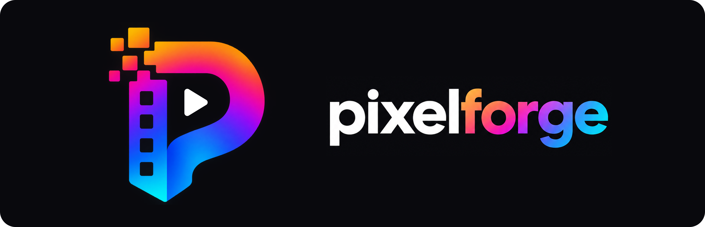

# pixelforge

A browser image, GIF and video editor built around one idea: **shaped pixelate and blur
overlays that track an animated GIF frame by frame**, with keyframes so an overlay can move
and scale as the animation plays.

React + Vite, plain JSX, no UI framework. Everything runs client-side — nothing is uploaded,
and it works offline.

```bash
npm install
npm run dev        # browser
npm run desktop    # the same app in an Electron window
```

Requires a Chromium browser (Chrome or Edge) for video, which uses WebCodecs.

---

## The core mechanic

An **effect layer** is not a picture, it is a region operator: at render time it reads the
pixels already composited beneath it, transforms them, masks the result to its shape and
draws it back. Because that happens on every frame, a pixelate circle sitting over an
animated GIF re-pixelates whatever the GIF is currently showing.

Effects available are pixelate, gaussian blur, pixel + blur, solid fill, darken, brighten,
desaturate, invert and noise. Each takes any shape — ellipse, rounded rectangle, triangle,
diamond, star or a freehand lasso — plus rotation, feathered edges, and an **Invert** toggle
that treats everything *except* the shape.

Several inverted overlays coexist: each one leaves alone the territory the others have
claimed, so keeping a second face clear is one more shape rather than a redraw.

---

## Cutting things out

**Background removal** is a colour key applied at render time, so an animated GIF re-keys
itself as it plays and nothing is baked into the document. *Only from the edges* floods
inward from the border so a colour that also appears inside the subject survives; *Anywhere*
removes it everywhere.

**AI background removal** runs a segmentation model locally on the GPU through ONNX Runtime
Web when colour cannot separate the scene. The image never leaves the machine; only the
weights are fetched, once, then cached.

| model | size | device | good for |
|---|---|---|---|
| **MODNet** (default) | 25.9 MB | WebGPU | people |
| **U²-Netp** | 4.6 MB | CPU | general subjects |

**The lasso** does three things with one tool: click to plot points, drag to trace freehand,
or switch on *Magnetic* and drag roughly around a subject while the outline finds the edge
itself. **AI select** clicks a subject and traces the model's mask into an ordinary editable
outline.

**Select by colour** takes everything that looks like what you clicked and hands back a
lasso, which is the tool for the flat regions the AI selector is not looking for — a sky, a
logo, one panel of a screenshot.

A closed outline is editable: drag a point, click a hollow midpoint to insert one, right-click
to remove one. **Drag a band across a stretch of points** and that whole run moves together,
or `Delete` takes it out and the outline closes straight across the gap.

The bar under an outline offers **Copy to layer**, **Cut to layer**, **Mask**, **Erase**,
**Pixelate** and **Text behind**. Cut-outs are non-destructive — a layer carries a polygon in
layer-relative coordinates, so the mask follows the layer when you move, resize or rotate it,
undo reverses it in one step, and masked GIF layers keep animating.

**The mask tool (`B`)** repairs a cut-out that came out wrong. Paint with *Keep* to bring back
what the cut took or *Remove* to take away what should not have survived, `Alt` flips between
them mid-stroke, and *Add to mask* unions a freshly drawn piece into the existing outline.
*Edit outline* hands the shape back to the lasso with its points intact.

**The eraser (`E`)** paints away part of a layer, with `Alt` to paint it back. **The clone
stamp (`K`)** copies one part of a picture over another — alt-click the source, then paint.
Both store strokes as points rather than pixels, so they scale and rotate with the layer, undo
one drag at a time, and never grow the saved project.

**The magic eraser (`J`)** paints over text, a logo or a blemish and replaces it with what was
probably behind it. It works out which colours under the brush are the lettering, so the
background between the letters is kept. The fill comes from a local model (MI-GAN, a 28 MB
download on first use, nothing uploaded), and from the surrounding picture when the model is
unavailable. *Remove* in the lasso bar does the same for an outline.

**Remove watermarks** (in the magic eraser) finds a mark repeated across a picture, tiled and
tilted, works out its shape from all its copies, and takes it off every one. A faint mark is
subtracted exactly, so the real picture underneath comes back; the grid, tilt and number of
copies are kept on the layer, and switching it off shows the original.

The brush tools hide the pointer while they are in hand: the ring drawn at the cursor is
sized to what the stroke will cover, and a crosshair inside it only clutters the thing you are
aiming.

Every brush shows itself **life-size above its sliders**, drawn by the same arithmetic that
lays a stroke down, so the size and the softness you see are the ones you get. A brush is a
fraction of the layer width rather than a number of pixels — which is what keeps a stroke the
same size on the picture at any zoom, and what makes "6%" a number nobody can picture.

**Masking shrink-wraps.** Cutting a subject out trims the layer box to what is left, so the
handles, the rotation pivot and snapping are all on the thing you can see. **Trim to subject**
does the same for a layer cut out by a matte.

---

## Text

**Fonts** are a measured list of the families the platform actually ships, each rendered in
itself in the menu. A text layer auto-sizes by default and grows from its anchor; dragging a
resize handle switches it to a fixed width, at which point the width becomes a wrap width.

**Double-click to edit in place** — a transparent textarea is matched to the layer's font,
size, colour, alignment and rotation, so what you see while typing is the layer with a caret
in it.

**Style part of a line.** Select a word and give it its own colour, weight, slant, size, face
or tracking; the runs move with the text as you edit around them. A line is as tall as the
largest thing on it and every piece shares one baseline, so a word set at three times the size
sits on the line rather than on top of it.

**Tracking** is a share of the size rather than a number of pixels, so type scaled up keeps
the spacing it was given. It is most of what separates a masthead from a word in a heavy
font.

**Text behind the subject** leaves the photo whole underneath, puts the text on top and lays a
cut-out copy of the same image above it. Both copies share one asset, so the model runs once.

**Outline through the subject** is the poster effect: solid letters where nothing covers them,
just their outline where the subject passes in front. It follows the letter's silhouette
rather than its glyph contours, so a letter built from overlapping pieces still outlines as
one shape. *Switch whole letters* changes at the gap between letters instead of mid-glyph.

---

## Shapes, gradients and layout

Vector shape layers with fill, stroke, corner radius and per-property opacity.

**Gradients** on any shape or text layer: two colours, an angle, and colour stops you drag on
the canvas itself rather than in a panel. Each end carries its own opacity, any number of
colours can be put between them, and a gradient can run out from the middle instead of across
the box. Set the span to *the group* and one ramp sweeps across every layer in it, so a title
of three words reads as one gradient instead of three.

**A shadow, or a glow**, on any layer — cast by what the layer draws rather than by its box,
so a cut-out throws the subject's shape and text throws the letters. Centre it and colour it
and the same five controls are a glow.

**The picture's own colours** sit under every colour control. Whatever image is on the canvas
is read for the colours it is mostly made of, and one click puts one into any field — which is
most of what makes type look chosen for a photograph rather than dropped on it.

**Snapping** compares a dragged layer's edges and centres against the canvas *and* against
every other layer, drawing a guide at whatever it caught. The tolerance is in screen pixels,
so the pull feels the same at 20% zoom and 400%; hold `Alt` to place something just off a
guide. Resizing lands on the same lines — only the edges the handle names may move, so a box
can be pulled out to exactly the width of the one above it.

**A grid** of margins and columns, set on the document and drawn on screen but never
exported. Everything snaps to the lines it declares, which is what turns elements placed into
elements composed: a masthead, a standfirst and a picture all agree without any of them having
been dragged onto any of the others.

**Equal spacing.** Drag a layer between two others and it is pulled to the point where the two
gaps match, with both stretches marked. Three things in a row with two different gaps read as
a mistake however well their edges line up — but a real alignment always wins the axis, since
that is the stronger claim.

**Every row in the layers panel draws itself** — the picture, the shape, the cut-out on a
checker ground — rather than a coloured square that says IMG. A text layer is named by what it
says, and follows it as you retype, until you name it by hand: a name given deliberately is a
decision, and typing must not undo it. (Video keeps a chip: a frame at that size is not lying
around, and a seek per row fills the playback cache the picture needs.)

**Clicking picks what you can see** — the topmost layer with a pixel actually drawn under the
pointer, so a subject cut out of a photograph does not catch clicks over the empty half of its
own rectangle. A click on a layer in front selects it, with nothing to deselect first.

**Groups** (`Ctrl+G`) keep a pile of layers together — hiding, opacity, locking and deleting
all fold through to the contents. Clicking a member selects the whole group, as in Figma;
double-click to go a level deeper.

**Mounts** put a border or a tilted Polaroid card around any image, and the card grows around
the picture rather than shrinking the picture inside it.

**Collage** arranges picked media into a grid of tilted mounts — overlapping, size-varied and
seeded so the arrangement survives undo and reload. Every card is an ordinary image layer, so
one can be nudged, straightened or recropped without disturbing the rest.

**Canvas size** changes the frame, not the picture in it, by default; *Fit* and *Fill* scale
the content with it, uniformly and about the centre. **Shrink canvas to fit content** moves
the canvas onto the artwork, **Scale content to fill canvas** moves the artwork onto the
canvas.

**Where you are** appears under the media bin the moment the whole canvas stops fitting on
screen: the frame in miniature with the visible part marked on it, and pressing it goes
somewhere else. Zoomed out far enough to see everything it is a picture of nothing, so it is
not there.

**The inspector orders itself by what is selected.** A shape leads with its shape, an overlay
with the effect it applies, a picture with framing and adjustments; panels with one control in
them, and panels that are not about the kind of thing selected, fall to the bottom.

**Flip** mirrors a picture inside its box, horizontally or vertically. It changes what is
sampled rather than the layer, so the box, the mask and anything keyframed stay where they
were.

**Cropping** works on either. With an image selected the crop tool crops that image; with
nothing selected it crops the whole document. Both are non-destructive — a sub-rect over the
asset, not a smaller bitmap.

---

## Animation

Turn on **Add animation tracking** for a layer and then just work: any property you change
grows its own track, keyed from where it was to where you put it. Or click the ◆ beside a
single property to animate only that one.

Position, size, rotation, opacity, volume, pixel size, blur radius, feather, effect amount,
corner radius and image framing are all animatable, each with its own timeline lane and
per-key easing (linear, ease-in, ease-out, ease-in-out, hold).

- The canvas draws the **motion path** as a dashed line with a dot per key.
- **This key / All keys** — a slider can set one key or every key on the track, and dragging
  on the canvas offsets the whole path so the shape of the motion survives.
- **Box-select** a band across the lanes to grab every key inside it, across lanes and layers;
  drag one to slide them all, `Delete` removes them in one undo step.
- The keyframe lanes and the video tracks can sit **side by side**, and scrolling zooms them.

**Motion tracking** follows a subject through footage and writes ordinary position keyframes.
It is normalized cross-correlation over an image pyramid rather than a model — nothing is
downloaded and nothing leaves the machine. It reports confidence, stops where it loses the
subject, refuses a featureless patch outright, and can follow size as well as position, in
either direction.

**Framing** — crop insets, zoom and pan — is keyframable, so a GIF can push in or reveal as it
plays. It resolves to one source rect per frame, so it stays exact on animated media.

**Motion trails** echo a layer at earlier times, following its real keyframed motion.
**Cinemagraph** freezes a layer at one instant and repaints only the lasso-masked region live.
**Follow the cursor** turns a screen recording into a camera move by frame-differencing for
the pointer, smoothing with a critically-damped spring and a dead zone, and emitting ordinary
keyframes you can edit or delete.

**Loop repair** fixes a clip that does not loop — ping-pong, crossfade or trim — as a remap
rather than a re-encode, so switching it off restores the original exactly.

---

## Video editing

A **clip** is three numbers: where it begins on the timeline, how far into the source it
starts, and where in the source it stops. Everything follows from those — trimming moves the
in or out point, sliding moves the start, splitting makes two clips that share a boundary, and
nothing ever touches the asset. A layer with no clip is visible throughout and loops, which is
the "text over a GIF" case this app started as.

**A clip is its filmstrip.** The thumbnails cover exactly what the clip plays and re-slice as
you trim, so trimming is never blind.

**Tracks** are one integer on a layer. Moving a clip between tracks re-sorts the layer array
to match, so the timeline and the layers panel can never disagree about what is in front.
There is always one empty row above the top one; drop something into it and it becomes real.

- Drag the body to slide, either end to trim, up or down to change track.
- `Ctrl+K` cuts every clip the playhead is inside; shift-click two pieces and **Join** puts
  them back, refusing out loud when they are not a genuine inverse.
- **Snapping** to every other clip's edges, the project start and the playhead, with a red
  guide at the one it caught.
- `Shift+Delete` **ripple deletes** — closes the hole behind what it removed, per track,
  without dragging other tracks out of sync. Plain `Delete` leaves the gap.
- **Close gaps** lays a track's clips end to end.
- Titles and overlays are clips too, so they trim, slide and join like anything else. Each
  kind lives on one row, so ten censors do not become ten rows.

**Transitions are the overlap.** Drag a clip so it laps over its neighbour and the region
where they cover each other is where one becomes the other; longer lap, longer transition.
There is nothing to select and no duration field, because the timeline already shows how long
it takes. The kinds are crossfade, dip to black, dip to white, and a wipe each way.

**Fades** are the other half: drag the square handles in a clip's top corners. A fade goes to
black rather than to transparent, composited inside the clip alone so a cut-out fades without
a black rectangle appearing around it. A transition supersedes a fade at the edge they share.

**Getting around.** `I` and `O` mark a range that plays as a loop and that Export can write on
its own; arrows skip and `,` `.` step a frame; `Home` and `End` go to the ends; `F` is full
screen; preview speed runs 0.25× to 4× without changing the edit.

Scrolling over the tracks scrolls them; **shift-scroll zooms**, with whatever is under the
pointer staying under it, and a readout says how far in you are. Right-click a clip for cut,
join, mute and the usual layer actions.

---

## Audio

Sound is decoded and played in the app, and **audio is the clock** — while sound is playing,
document time is derived from the audio context rather than accumulated from frame deltas, so
the picture cannot drift against speech. If the audio clock stalls, time falls back to
counting frames.

**Sound has its own lane** under each video track. The height of the lane is the volume, so a
point has somewhere to be and the line between points is the shape of the fade. The points are
ordinary keyframes: they undo, ease, copy with the layer and save into the project.

**Clips carry their sound with them** — the same three numbers that index a frame table index
a sound buffer. A crossfade crosses the audio too, and a clip's own fades combine with it by
taking whichever is quieter.

**J and L cuts.** Drag the ends of the audio lane past the picture and the sound leads into
the next shot or runs on under it.

**The waveform** draws the body as RMS and the peaks as a faint outline around it — the reach
of the sound and the weight of it. Quiet files are scaled up, capped, because that is exactly
the material whose shape you most need to see.

---

## Looks

**Adjustments** per image layer: brightness, contrast, saturation, hue, blur, grayscale, sepia
and invert, with presets. **Recolour** tints a layer to a single colour, which is how a black
logo becomes a white one.

**Retro looks** are palette quantisation with real dithering, applied last in the draw so they
colour a cut-out and its sticker border too — 1-bit, Game Boy, VHS, halftone, C64 and NES,
each a few milliseconds a frame. **Duotone** sits beside them: a photograph reprinted in two
inks, every pixel keeping its brightness and giving up its hue.

**Sticker mode** grows a border around a cut-out and casts the shadow from the silhouette
rather than the artwork, so it takes the shape of the sticker. Any cut-out will do — a
background key, a lasso mask, a brushed mask or eraser strokes.

**Batch apply** treats the document as a recipe: nominate one image layer as the slot and
every input file is run through the same overlays, text, effects and cut-out settings. Three
fit modes, and one bad file is reported by name rather than abandoning the other twenty-nine.

---

## Media, saving and recovery

**Everything imported goes to the Media bin**, always — nothing reaches the canvas until you
pick it and press Add to canvas or double-click it. The bin lives on the document, so it
saves, loads and undoes with everything else, and deleting a layer never takes its material
with it.

**Save** (`Ctrl+S`) keeps the project in this browser; **Open Existing…** (`Ctrl+O`) lists what
you have with thumbnails and can also open a `.pfz` from disk. Only **Export** downloads
anything.

A `.pfz` is a plain ZIP holding the document, the exact bytes you imported, and a thumbnail —
so the round trip is lossless and you can unzip it to get your media back. Dropping one onto
the window opens it, and on the desktop double-clicking one in a file manager does too.

**Autosave** covers a crash: the next launch offers to recover the session. **Automatic
backups** cover the likelier loss — every save and every export also writes a real `.pfz` into
the app's own data folder, listed under *Open Existing… → Automatic backups*, so exporting a
PNG and moving on does not strand you without the layers that made it.

---

## Import and export

Images, GIFs and MP4s. GIFs are decoded in-house — a dependency-free GIF87a/89a decoder with
LZW, interlacing, transparency and all four disposal methods — so scrubbing and export are
frame-accurate in every browser. MP4 timing is demuxed up front and pixels are decoded on
demand through WebCodecs into a bounded cache, so a long clip does not have to fit in memory.

| out | notes |
|---|---|
| **PNG** | the current frame, with a real `pHYs` resolution chunk |
| **GIF** | preserves the source's own frame timing exactly |
| **WebM** | recorded from the canvas, browser or desktop |
| **MP4** | H.264 through a local ffmpeg, desktop only, audio muxed back in |
| **Project** | a `.pfz` |

**Print size.** Ask for a physical width, a unit and a resolution and export works backwards
to the pixel count — 100mm at 300dpi is 1181px — then writes the resolution into the PNG so
print software does not have to guess.

**File names** are seeded from the project name, with the extension shown but not editable,
and the button says what it is about to write.

---

## The command line

`pf.mjs` renders a document without opening the editor, so an agent or a script can drive it.

```bash
node pf.mjs render card.json --out card.png
node pf.mjs render card.json --out card.gif --fps 24
node pf.mjs render card.json --out frames/ --frames
```

A spec is a plain document — a size, a background and a list of layers, with every default
filled in, so `{ "type": "text", "text": "Hello", "x": 40, "y": 40, "size": 64 }` is enough.
Media is listed alongside and referred to by name. It runs the real engine in a headless
browser rather than reimplementing it, because the renderer *is* canvas code and a second
renderer is a second set of answers to keep in step. See [`examples/card.json`](examples/card.json).

---

## The desktop build

Electron is Chromium, so it does not make the canvas faster. What it buys is **ffmpeg** for
real H.264 output with audio, **a real filesystem** so a batch writes a folder instead of a
zip, and the option of native inference later.

Nothing in `src/` knows it is running under Electron — the only surface is
[`desktop.js`](src/engine/desktop.js), and every function in it works in a plain browser, so
the web build stays a first-class target.

```bash
npm run desktop         # dev server + Electron, hot reload
npm run desktop:run     # production build in an Electron window
npm run desktop:build   # installer + portable exe, then verifies both
npm run make:icons      # every icon size from logo.png
```

The desktop build draws its own title bar, keeps an unsaved-changes guard on the window close,
and registers the `.pfz` file association at install. **ffmpeg is not bundled** — it is found
on `PATH` or at `PF_FFMPEG`, and everything needing it degrades to a clear message when it is
missing. There is no code-signing certificate, so Windows SmartScreen will warn on first run.

---

## Keys

Every tool answers to two keys: the letter, and its position in the rail. `1` is the selector.

| | |
|---|---|
| `V` `C` `P` `L` `S` `T` | move, crop, pixel overlay, lasso, shape, text |
| `E` `J` `B` `K` `W` `I` `H` | erase, magic eraser, mask brush, clone stamp, colour select, eyedropper, pan |
| `1`…`9` `0` | the same tools, in rail order, from the selector down |
| `Space` | play / pause (hold + drag to pan) |
| `I` / `O` | mark in / out (`I` is the eyedropper while that tool is in hand) |
| `,` `.` / arrows | step a frame / skip, or nudge a selected layer |
| `Ctrl+S` / `Ctrl+O` | save project / open project |
| `Ctrl+C` / `Ctrl+X` / `Ctrl+V` | copy / cut / paste layers |
| `Ctrl+G` / `Ctrl+Shift+G` | group / ungroup layers |
| `Ctrl+K` | cut every clip at the playhead |
| `Ctrl+Z` / `Ctrl+Shift+Z` | undo / redo |
| `Ctrl+D` / `Delete` | duplicate / delete layer |
| `Shift+Delete` | ripple delete |
| `[` `]` | move layer down / up the stack |
| wheel | zoom the canvas about the cursor; scroll the timeline |
| shift+wheel | zoom the timeline about the cursor |
| `F` | full screen |

---

## Layout

```
src/engine/     render.js      compositor, frame lookup, export frame timing
                gif.js         GIF decoder
                video.js       MP4 demux, on-demand WebCodecs decode
                audio.js       playback graph, volume curves
                waveform.js    peak/RMS summaries
                assets.js      decoded-bitmap registry, kept out of undo history
                shapes.js      shape paths, rotated bounds, hit testing
                effects.js     region effects, masking, feathering
                gradient.js    gradient geometry and stops
                richtext.js    styled runs inside one text layer
                keyframes.js   interpolation, key CRUD
                clips.js       clip arithmetic, audio edges, overlays
                transitions.js overlaps, fades, dips and wipes
                tracker.js     NCC motion tracking, keyframe thinning
                matte.js       colour-key background removal
                aiMatte.js     ONNX segmentation
                models.js      model download, cache and runtime, shared by both models
                heal.js        magic eraser: finding the text, filling from the picture
                healed.js      magic eraser fills, kept on their strokes and drawn in
                inpaint.js     MI-GAN inpainting
                watermark.js   finding a repeated mark, and subtracting it
                fft.js         the FFT behind finding what repeats
                subject.js     what counts as a cut-out; sticker geometry
                trace.js       marching squares, Douglas-Peucker
                edges.js       colour-gradient edge maps
                lassoedit.js   editing a run of outline points
                palette.js     the colours a picture is made of
                grid.js        margins and columns
                tools.js       the rail's tools and both of their keys
                brush.js       brush size, softness, and the life-size preview
                erase.js       eraser and region strokes
                clone.js       clone-stamp strokes
                collage.js     collage layout maths
                cursor.js      pointer detection and camera moves
                retro.js       palette quantisation and dithering
                loop.js        loop repair
                snap.js        alignment snapping and guides
                groups.js      group tree, folded visibility and opacity
                exporters.js   PNG / GIF / WebM
                project.js     .pfz pack and unpack
                autosave.js    IndexedDB sessions
                backup.js      the automatic backup ring
                desktop.js     the only Electron-aware surface
src/state/      store.js       zustand document + history
src/components/ CanvasStage, Timeline, Filmstrip, AudioRow, LayersPanel, Inspector,
                ToolRail, TopBar, MediaPool, MediaView, ExportDialog, OpenDialog,
                CollageDialog, LassoBar, LayerContextMenu
```

---

## Tests

Browser suites drive the real UI in Chrome through Playwright and assert on rendered pixels —
that a pixelate block is flat, that its neighbour differs, that the region changes across GIF
frames, that a keyframed overlay physically travels across the exported GIF. The project suite
saves a `.pfz`, reloads into a clean session, reopens it and asserts the document renders
pixel-identically at every sampled time.

They live under `tests/`: `tests/browser/` for everything that drives Chrome, `tests/unit/`
for the DOM-free suites that run under plain node in milliseconds, and `tests/` itself for the
shared helper and the benchmarks. Fifty browser suites, two Electron suites, eighteen
unit suites — **2131 checks**, in about two minutes.

```bash
npm run dev           # in one terminal
npm test              # in another — the lot, in parallel
npm run test:changed  # only the suites your edits could have broken
npm run test:units    # no browser needed
npm run test:desktop  # builds, then boots the Electron shell
npm run bench:video -- path.mp4
```

`npm run make:testgif` regenerates every fixture in `public/test/`. They are all synthetic and
built to contain traps: `greenscreen.gif` hides a patch of the exact background colour *inside*
the subject, and `screencast.gif` includes a blinking caret, which is the classic false
positive for motion-based cursor detection.

---

## Licence

MIT — see [LICENSE](LICENSE).
